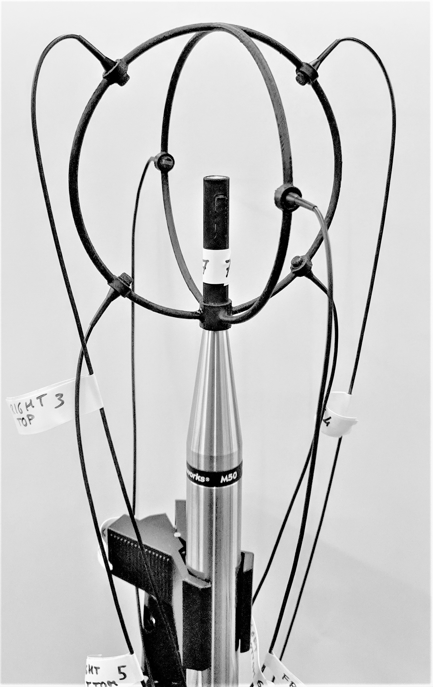

# BinauralSDM

Matlab code to generate binaural RIRs for arbitrary head orientations using the Spatial Decomposition Method [1, 2] using the BinauralSDM approach with RTMod+AP equalization from [3].

## Installation and dependencies

The following dependencies are necessary for the repository to run succesfully. Please make sure that they are included in your Matlab search path before executing any demo:

- SDM Toolbox for Matlab (must be downloaded manually): https://www.mathworks.com/matlabcentral/fileexchange/56663-sdm-toolbox - by Sakari Tervo and Jukka Patynen.

- SOFA API for Matlab (must be downloaded manually): https://github.com/sofacoustics/API_MO - by the SOFA conventions team.

- GetLebedevGrid.m (included) - by Robert Parrish.

- parfor_progressbar.m (included) - by Daniel Terry.

- Denoise_RIR.m (included) - by Densil Cabrera and Daniel Ricardo Jimenez Pinilla.

## Demos

Set your Matlab working directory to ./Src/Examples to execute the examples:

- **Demo_BinauralSDM_QuantizedDOA_andRTModAP.m**  
Generates BRIRs for a multitude of head orientations using the RTMod+AP equalization approach.   
To ensure that the example runs, it performs the analysis and synthesis of an example RIR measured with the FRL Array (10 cm diameter) and using TDOA analysis.  
The HRIR dataset (Neumann KU100) is downloaded on the fly from the TH Koeln Audio Group server. This can be easily swapped by any arbitrary HRIR dataset in SOFA format.  
This example generated direction dependent early reflections and direction independent late reverberation, after an arbitrary (configurable) mixing time. The example also includes spatial quantization of the DOA information. The file can be modified
in a straightforward manner to accommodate other analysis and rendering parameters and input data. 


More examples will be added in the future, featuring modified decay slopes for reverberation time manipulations, algorithmic late reverberation, and
spatial manipulations. 

## Microphone arrays

Files for 3D printing of a microphone array holder (FRL Array) are included in ./Data/ArrayDesigns/. These are hexahedral arrays (6 DPA 4060) with a center microphone (Earthworks M30/M50) and a diameter of 5 or 10cm.



Other array geometries can be accommodated by modifying the file ./Src/create_MicGeometry.m. The current code also accommodates Tetramic and Eigenmike arrays (with TDoA estimation) but we recommend to not use them (see [3] for details and justification).

## Citing BinauralSDM
If you use this code in your research, please cite the following [paper](https://www.aes.org/e-lib/browse.cfm?elib=21010):
```
@article{amengual20BSDM,
  title     =     {Optimizations of the Spatial Decomposition Method for Binaural Reproduction,
  author    =     {Sebastia V. Amengual Gari and Johannes Arend and Paul Calamia and Philip Robinson},
  journal   =     {Journal of the Audio Engineering Society},
  volume    =     {68},
  number    = 	  {12},
  pages     =     {959 -- 976},
  doi       =     {https://doi.org/10.17743/jaes.2020.0063}
  month     =     {12}
  year      =     {2020}
}
```

## References

[1] S. Tervo, J. Patynen, A. Kuusinen, and T. Lokki, “Spatial Decomposition Method for Room Impulse Responses,” J. Audio Eng. Soc., vol. 61, no. 1/2, pp. 17–28 (2013 Jan.).

[2] S. Tervo, J. Patynen, N. Kaplanis, M. Lydolf, S. Bech, and T. Lokki, “Spatial Analysis and Synthesis of Car Audio System and Car Cabin Acoustics With a Compact Microphone Array,” J. Audio Eng. Soc., vol. 63, no. 11, pp. 914–925 (2015 Nov.), https://doi.org/10.17743/jaes.2015.0080.

[3] S. V. Amengual Gari, J. Arend, P. Calamia, P. Robinson, “Optimizations of the Spatial Decomposition Method for Binaural Reproduction,” J. Audio Eng. Soc., vol. 68, no. 12, pp. 959-976 (2020 Dec.), https://doi.org/10.17743/jaes.2020.0063.

## Contributing
See the [CONTRIBUTING](CONTRIBUTING.md) file for how to help out.

## License
BinauralSDM is CC-BY-4.0 licensed, as found in the [LICENSE](LICENSE) file.

## Contact

Sebastia V. Amengual (samengual@fb.com)

Philip Robinson (philrob22@fb.com)
